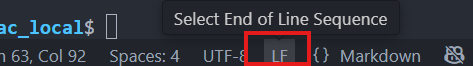
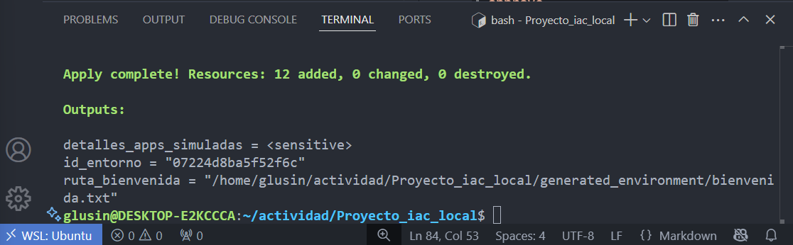
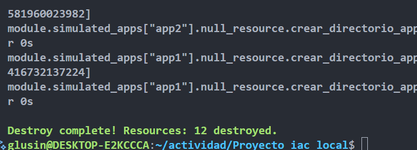

# Actividad: Orquestador local de entornos de desarrollo simulados con Terraform

**PreRequisitos:**

- Terraform.
- Python 3.
- Conocimientos básicos de bash.
- Editor de texto o IDE.

## Instalación Terraform ubuntu

1. Actualizar lista de paquetes

    ```bash
    sudo apt-get update && sudo apt-get install -y gnupg    software-properties-common
    ```

2. Agregar la clave GPG de HashiCorp

    ```bash
    wget -O- https://apt.releases.hashicorp.com/gpg | \
    gpg --dearmor | \
    sudo tee /usr/share/keyrings/hashicorp-archive-keyring.gpg > /dev/null
    ```

3. Verificar la huella de la llave

    ```bash
    gpg --no-default-keyring \
    --keyring /usr/share/keyrings/hashicorp-archive-keyring.gpg \
    --fingerprint
    ```

4. Agregar repositorio de HashiCorp

    ```bash
    echo "deb [signed-by=/usr/share/keyrings/hashicorp-archive-keyring.gpg] https://apt.releases.hashicorp.com $(lsb_release -cs) main" | sudo tee /etc/apt/sources.list.d/hashicorp.list
    ```

5. Instalar terraform

    ```bash
    sudo apt install terraform
    ```

**Más información en [Terraform/install](https://developer.hashicorp.com/terraform/tutorials/aws-get-started/install-cli)**

## Problemas previos

Estoy accediendo a **ubuntu** mediante WSL en windows, ya que el proyecto no reconoce ciertos comandos en bash ejecutados en Windows.

### 1. Ejecutable de python

Inicialmente cambio la variable de ejecución de python a la ruta que tengo por defecto con ubuntu.

```json
variable "python_executable" {
  description = "Ruta al ejecutable de Python (python o python3)."
  type        = string
  default     = "/usr/bin/python3" # <--- cambio
}
```

### 2. Archivos ocultos

Algunos archivos tenían caracteres ocultos `\r` debido a que eran tratador para ejecución en windows. Problema que hace que bash no sea capaz de leer bien ciertos archivos.

Al correr en Linux o mediante WSL, hay que quitarlos manualmente cambiando de **CRLF a LF** en la barra inferior a la derecha dentro de vscode o de el IDE utilizado.



### 3. Flag "-p"

Verificar que el comando mkdir tenga el flag `-p`, ya que sino al intentar crear un directorio dentro de una estructura que aún no existe, mkdir fallará.

```json
provisioner "local-exec" {
    command = "mkdir -p ${local.install_path}/logs"
  }
```

## Inicializar el proyecto

Este proyecto contiene un orquestador local, que mediante Terraform, crea, configura y valida entornos de desarrollo simulados con múltiples servicios.

```yaml
# inicializamos el entorno y descargar los providers
terraform init

# Muestra la infraestructura que se creará en base a los archivos creados
# (opcional)
terraform plan

# Creación de la infraestructura
terraform apply -auto-approve
```

Por último, verificaremos la salida en consola que segun el archivo `outputs-tf` debería ser el siguiente:

```yaml
output "detalles_apps_simuladas" {
  value = {
    for k, app_instance in module.simulated_apps : k => {
      config_path  = app_instance.service_config_path
      install_path = app_instance.service_install_path
      # metadata    = app_instance.service_metadata_content # Puede ser muy verboso
      metadata_id = app_instance.service_metadata_content.uniqueId
    }
  }
  sensitive = true # Porque contiene mensaje_global (indirectamente)
}
```

Y efectivamente, hemos creado la infraestructura de forma satisfactoria.



y para el momento que ya no necesitemos tener la infraestructura activa, podemos destruirla.

```bash
# destruye la infraestructura existente
terraform destroy -auto-approve
```



## Explicación detallada por fases

### Fase 1: Fundamentos de terraform y primer recurso local

`version.tf` :

```terraform
# Bloque que define requisitos generales
terraform { 
  # version de terraform
  required_version = ">= 1.0"

  # proveedores necesarios
  required_providers {

    # permite interactuar con archivos locales
    local = {
      source  = "hashicorp/local"
      # permite versiones 2.X
      version = "~> 2.5"
    }

    # permite generar valores aleatorios
    random = {
      source  = "hashicorp/random"
      # permite versiones 3.X
      version = "~> 3.6"
    }
  }
}
```

#### `main.tf`

Dentro de este archivo se crea 2 recursos en base a lo que nos aporta los proveedores anteriores.

- **resource** `local_file`

  Recurso que crea archivos físicos locales (.txt, .json, .yaml, etc) en la maquina donde se ejecuta terraform.

  ```terraform
  resource "local_file" "bienvenida" {
  content  = "Bienvenido al proyecto IaC local! Hora: ${timestamp()}"
  filename = "${path.cwd}/generated_environment/bienvenida.txt"
  }
  ```

- **resource** `random_id`

  Generador de IDs aleatorios en formato binario

  ```terraform
  resource "random_id" "entorno_id" {
    byte_length = 8
  }
  ```

#### `outputs.tf`

Archivo que almacena todas las salidas a consola.

```terraform
output "id_entorno" {

  value = random_id.entorno_id.hex

  # value = "f71609dd7d8bab"a8"
}

output "ruta_bienvenida" {

  value = local_file.bienvenida.filename

  # value = "Bienvenido ..."
}
```

### Fase 2: Variables, archivos de configuración y scripts Bash

#### `variables.tf`

Define el esqueleto de cada variable de manera global.

```terraform
variable "nombre_entorno" {
  description = "Nombre base para el entorno generado."
  type        = string
  default     = "desarrollo"
}

variable "numero_instancias_app_simulada" {
  description = "Cuántas instancias de la app simulada crear."
  type        = number
  default     = 2
}

variable "mensaje_global" {
  description = "Un mensaje para incluir en varios archivos."
  type        = string
  default     = "Configuración gestionada por Terraform."
  sensitive   = true # no se muestra en consola
}
```

#### `terraform.tfvars.example`

Archivo plantilla que **terraform no lee**, solo sirve de referencia.

```terraform
nombre_entorno = "mi_proyecto_local"
numero_instancias_app_simulada = 3
// mensaje_global se puede omitir para usar default, o definir aquí.
```

#### `modules/environment_setup`

Este modulo crea el entorno inicial de nuestra infraestructura.

- Crea un ID aleatorio para el README.
- Crea un archivo README.md (vacio).
- muestra la ruta del README en consola.

1. `./environment_setup/variables.tf`

    ```terraform
    variable "base_path" {
      description = "Ruta base para el entorno."
      type        = string
    }

    variable "nombre_entorno_modulo" {
      description = "Nombre del entorno para este módulo."
      type        = string
    }
    ```

2. `./environment_setup/main.tf`

    ```terraform
    # Recurso que no administra un recurso real
    resource "null_resource" "crear_directorio_base" {
      # provisioner: ejecuta acciones adicionales
      # "local-exec": permite ejecutar scripts locales
      provisioner "local-exec" {
        command = "mkdir -p ${var.base_path}/${var.nombre_entorno_modulo}_data"
      }
      # Se ejecute si cambia el nombre del entorno
      triggers = {
        dir_name = "${var.base_path}/${var.nombre_entorno_modulo}_data"
      }
    }

    # permite crear un README
    resource "local_file" "readme_entorno" {
      content  = "Este es el entorno ${var.nombre_entorno_modulo}. ID: ${random_id.entorno_id_modulo.hex}"
      filename = "${var.base_path}/${var.nombre_entorno_modulo}_data/README.md"
      depends_on = [null_resource.crear_directorio_base]
    }

    # permite crer un ID de 4 bytes cualquiera
    resource "random_id" "entorno_id_modulo" {
      byte_length = 4
    }

    # recurso que no crea infraestructura REAL
    # crea recursos "fantasmas" dentro de terraform.tfstate
    resource "null_resource" "ejecutar_setup_inicial" {

      # depende de que se haya creado un README
      depends_on = [local_file.readme_entorno]
      # trigerea esto si el README cambia
      triggers = {
        readme_md5 = local_file.readme_entorno.content_md5
      }

      provisioner "local-exec" {
        command     = "bash ${path.module}/scripts/initial_setup.sh '${var.nombre_entorno_modulo}' '${local_file.readme_entorno.filename}'"
        interpreter = ["bash", "-c"]
        working_dir = "${var.base_path}/${var.nombre_entorno_modulo}_data" # Ejecutar script desde aquí
      }
    }
    ```

3. `./environment_setup/outputs.tf`

    Muestra la ruta del README creado en `./environment_setup`.

    ```terraform
    output "ruta_readme_modulo" {
      value = local_file.readme_entorno.filename
    }
    ```

4. `./scripts/initial_setup.sh`

    ```bash
    #!/bin/bash
    # Script: initial_setup.sh

    # asigna variables
    ENV_NAME=$1
    README_PATH=$2


    echo "Ejecutando setup inicial para el entorno: $ENV_NAME"
    #
    echo "Fecha de setup: $(date)" > setup_log.txt
    echo "Readme se encuentra en: $README_PATH" >> setup_log.txt

    echo "Creando archivo de placeholder..."
    touch placeholder_$(date +%s).txt
    echo "Setup inicial completado."

    # Simular más líneas de código
    for i in {1..20}; do
      echo "Paso de configuración simulado $i..." >> setup_log.txt
      # sleep 0.01
    done
    ```

3.  **Ejercicio de idempotencia y scripts externos:**

      * **Tarea:** El script `initial_setup.sh` crea `placeholder_$(date +%s).txt`, lo que significa que cada vez que se ejecuta (si los `triggers` lo permiten), crea un nuevo archivo.
      * **Pasos:**
        1.  Modifica `initial_setup.sh` para que sea más idempotente: antes de crear `placeholder_...txt`, debe verificar si ya existe un archivo `placeholder_control.txt`. Si no existe, lo crea y también crea el `placeholder_...txt`. Si `placeholder_control.txt` ya existe, no hace nada más.
        2.  Ajusta los `triggers` del `null_resource "ejecutar_setup_inicial"` en el módulo `environment_setup` para que el script se ejecute de forma más predecible (quizás solo si una variable específica cambia).
      * **Reto adicional:** Implementa un "contador de ejecución" en un archivo dentro de `generated_environment`, que el script `initial_setup.sh` incremente solo si realmente realiza una acción.

      * **Resolución:**


4.  **Ejercicio de seguridad simulada y validación:**

      * **Tarea:** El `mensaje_global` se marca como `sensitive` en `variables.tf`. Sin embargo, se escribe directamente en `config.json`.
      * **Pasos:**
        1.  Modifica el script `validate_config.py` para que busque explícitamente el contenido de `mensaje_global` (que el estudiante tendrá que "conocer" o pasar como argumento al script de validación) dentro de los archivos `config.json`. Si lo encuentra, debe marcarlo como un "hallazgo de seguridad crítico".
        2.  Discute cómo Terraform maneja los valores `sensitive` y cómo esto se puede perder si no se tiene cuidado al pasarlos a scripts o plantillas.
        3.  (Opcional) Modifica la plantilla `config.json.tpl` para ofuscar o no incluir directamente el `mensaje_global` si es demasiado sensible, tal vez solo una referencia.


## Ejercicio 3

1. Modificar el script `initial_setup.sh` para hacerlo idempotente
  ```bash
  #!/bin/bash
  # Script: initial_setup.sh

  ENV_NAME=$1
  README_PATH=$2

  echo "Ejecutando setup inicial para el entorno: $ENV_NAME"

  if [ ! -f placeholder_control.txt ]; then
      echo "Fecha de setup: $(date)" > setup_log.txt
      echo "Readme se encuentra en: $README_PATH" >> setup_log.txt
      echo "Creando archivo de placeholder..."
      touch placeholder_$(date +%s).txt
      touch placeholder_control.txt
      echo "Setup inicial completado."
  else
      echo "El setup inicial ya fue realizado previamente. No se realizan cambios."
  fi
  ```
2. Ajusta los triggers del `null_resource "ejecutar_setup_inicial"` para que dependan solo de una variable específica.

Inicialmente el script `initial_setup.sh` se ejecuta cada vez que cambia el contenido del `README`. Pero a veces al equipo le parecería mejor si el script solo se ejecute si cambia una variable, como por ejemplo si se le cambiara el nombre al entorno generado.

```diff
resource "null_resource" "ejecutar_setup_inicial" {
  depends_on = [local_file.readme_entorno]
  triggers = {
-    readme_md5 = local_file.readme_entorno.content_md5 # Se reejecuta si el README cambia
+    nombre_entorno_modulo = var.nombre_entorno_modulo # Se reejecuta si el nombre del entorno cambia
  }
  provisioner "local-exec" {
    command     = "bash ${path.module}/scripts/initial_setup.sh '${var.nombre_entorno_modulo}' '${local_file.readme_entorno.filename}'"
    interpreter = ["bash", "-c"]
    working_dir = "${var.base_path}/${var.nombre_entorno_modulo}_data" # Ejecutar script desde aquí
  }
}
```

