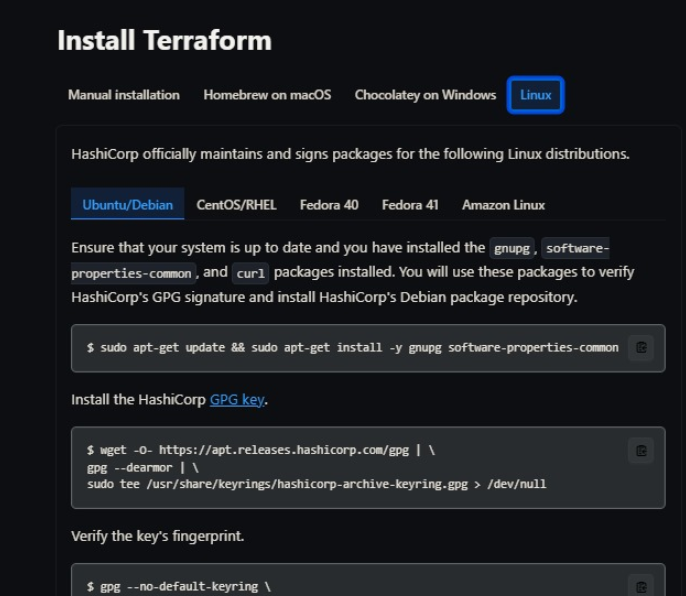
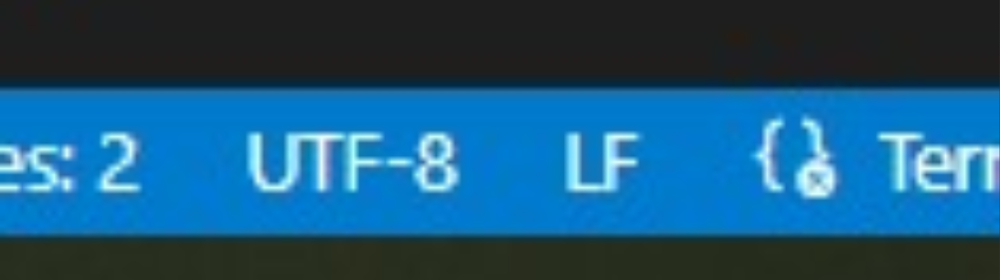
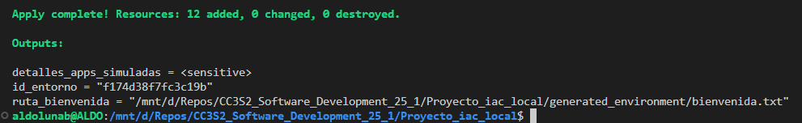
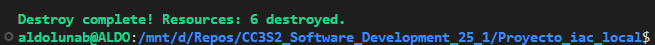
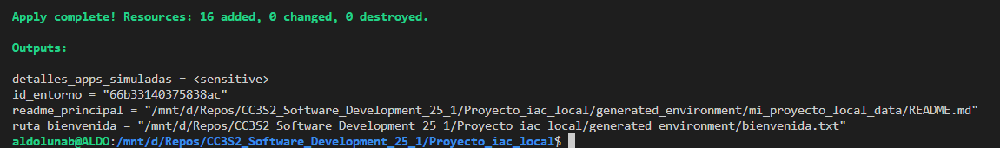
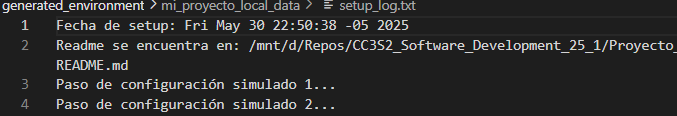

# Actividad: Orquestador local de entornos de desarrollo simulados con Terraform

## Requisitos

Acerca de los requisitos, para futura referencia, instalé Terraform siguiendo [el procedimiento oficial de HashiCorp](https://developer.hashicorp.com/terraform/tutorials/aws-get-started/install-cli#install-terraform).



## Comandos Terraform

### Problemas previos

Como estoy usando WSL en Windows, en "./main.tf" cambié la ruta por defecto de la variable "python_executable" a "/usr/bin/python3". Sin embargo, luego de ejecutar ``terraform apply`` surgieron varios errores no contemplados en la guía.

Los archivos tenían caracteres ocultos '\r' debido a que estos archivos venían de un sistema que usa Windows. Esto es un problema porque al parecer Bash no es capaz de leer bien los archivos .sh si tiene estos caracteres de retorno de carro.

Al correr en Linux o WSL, hay que quitarlos. En VS Code la forma más fácil de hacer esto es cambiando de CRLF a LF en su banda azulada inferior a la derecha.



Luego hay que asegurarse de que el comando mkdir tenga el flag "-p", ya que en Linux no se puede crear un directorio si su padre no existe a menos que se use el flag "-p". Por ejemplo, aquí:

```hcl
provisioner "local-exec" {
    command = "mkdir -p ${var.base_path}/${var.nombre_entorno_modulo}_data"
}
```

### Inicializar Terraform y aplicar cambios

Según la guía, para crear y configurar todos los recursos simulados definidos por este proyecto, debemos de ejecutar los siguientes comandos de Terraform desde la carpeta raíz:

```bash
terraform init
terraform plan # opcional
terraform apply
```

Esto fue suficiente para generar y configurar los recursos definidos en el proyecto:



### Planificar cambios

Esto se hace antes de ``terraform apply``, pero si inspeccionamos el plan generado haciendo ``terraform plan -no-color > plan.txt`` (lo guardamos en un documento de texto porque es una salida extensa) podremos entender qué recursos son creados. Vamos a filtrar solo las líneas que contienen ``+ resource``, que son en total 12:

```bash
+ resource "local_file" "bienvenida"               # 1
+ resource "null_resource" "check_all_healths"     # 2
+ resource "null_resource" "validate_all_configs"  # 3
+ resource "random_id" "entorno_id"                # 4

# A partir de aquí: recursos generados por module.simulated_apps
# app1
+ resource "local_file" "config_json"              # 5
+ resource "local_file" "metadata_json"            # 6
+ resource "null_resource" "crear_directorio_app"  # 7
+ resource "null_resource" "start_service_sh"      # 8

# app2
+ resource "local_file" "config_json"              # 9
+ resource "local_file" "metadata_json"            # 10
+ resource "null_resource" "crear_directorio_app"  # 11
+ resource "null_resource" "start_service_sh"      # 12

```

### Ver outputs

Además, vemos los siguientes outputs:

- ```bash
    terraform output id_entorno
    ```

    ```txt
    "f174d38f7fc3c19b"
    ```

- ```bash
    terraform output ruta_bienvenida
    ```

    ```txt
    "/mnt/d/Repos/CC3S2_Software_Development_25_1/Proyecto_iac_local/generated_environment/bienvenida.txt"
    ```

- ```bash
    terraform output detalles_apps_simuladas
    ```

    ```hcl
    {
        "app1" = {
            "config_path" = "/mnt/d/Repos/CC3S2_Software_Development_25_1/Proyecto_iac_local/generated_environment/services/app1_v1.0.2/config.json"
            "install_path" = "/mnt/d/Repos/CC3S2_Software_Development_25_1/Proyecto_iac_local/generated_environment/services/app1_v1.0.2"
            "metadata_id" = "fee68f45-73ea-4f20-8c8f-f35667d3df18"
        }
        "app2" = {
            "config_path" = "/mnt/d/Repos/CC3S2_Software_Development_25_1/Proyecto_iac_local/generated_environment/services/app2_v0.5.0/config.json"
            "install_path" = "/mnt/d/Repos/CC3S2_Software_Development_25_1/Proyecto_iac_local/generated_environment/services/app2_v0.5.0"
            "metadata_id" = "e434baef-2246-42cb-8b4e-dc57338d6362"
        }
    }
    ```

### Destruir recursos

También podemos destruir todos los recursos:

- ```bash
    terraform destroy
    ```

    ```txt
    Plan: 0 to add, 0 to change, 12 to destroy.

    Changes to Outputs:
    - detalles_apps_simuladas = (sensitive value) -> null
    - id_entorno              = "4d2e9d55fe6e5cc5" -> null
    - ruta_bienvenida         = "/mnt/d/Repos/CC3S2_Software_Development_25_1/Proyecto_iac_local/generated_environment/bienvenida.txt" -> null
    ```

### Operaciones avanzadas

Pero podemos ser más específicos en qué recursos destruimos. Por ejemplo, podemos destruir solo los recursos de una de las apps:

```bash
terraform destroy -target='module.simulated_apps["app2"]' -auto-approve
```



Lo interesante es que no solo se borraron los cuatro recursos directamente asociados con la app:

```txt
local_file.config_json
local_file.metadata_json
null_resource.crear_directorio_app
null_resource.start_service_sh
```

También se borraron otros dos recursos comunes:

```txt
null_resource.check_all_healths
null_resource.validate_all_configs
```

Para explicar esto, debemos inspeccionar el código HCL de "./main.tf":

```hcl
resource "null_resource" "validate_all_configs" {
  depends_on = [module.simulated_apps] # Asegura que las apps se creen primero
  # ...
}

resource "null_resource" "check_all_healths" {
  depends_on = [null_resource.validate_all_configs] # Después de validar
  # ...
}
```

Lo que sucede es que, si destruimos un recurso, todos los recursos que dependan de este también se destruyen. En el código se ve que el recurso validate_all_configs depende de las apps simuladas. Basta que una app se destruya para que validate_all_configs se destruya también. Y de este recurso depende también el otro recurso check_all_healths, que por lo tanto también es destruido. Esto explica por qué se destruyeron 6 recursos y no solo los 4 de app2.

## Error en Fase 2

Al intentar hacer las modificaciones solicitadas en la guía, surgió un problema en el recurso ejecutar_setup_inicial del módulo "./modules/environment_setup". Este recurso tiene definido en su bloque provisioner un argumento working_dir que cambia el directorio de trabajo desde el cual el script se ejecuta para crear un archivo setup_log.txt en ese directorio (generated_evironment/mi_proyecto_local_data). Pero la ruta del script en el argumento command era relativa, como se puede ver en el fragmento:

```hcl
provisioner "local-exec" {
    command     = <<EOT
        bash "${path.module}/scripts/initial_setup.sh" "${var.nombre_entorno_modulo}" "${local_file.readme_entorno.filename}"
    EOT
    interpreter = ["bash", "-c"]
    working_dir = "${var.base_path}/${var.nombre_entorno_modulo}_data" # Ejecutar script desde aquí
}
```

Según la documentación de Terraform, ${path.module} es una ruta relativa, ya que representa la ruta desde el el módulo raíz hasta el módulo actual. Al parecer, quien elaboró el ejericio no lo tuvo en cuenta. Por esto es que al cambiar el directorio de trabajo con work_dir la ruta del script también cambiaba, y no tenía ningún sentido. Esto se arregló usando una referencia absoluta antes de path.module: ``path.cwd``. Como en ningún momento usamos un comando como chdir, podemos usar de forma segura path.cwd para que nos dé el directorio desde el cual se ejecutó el comando ``terraform apply``. El ajuste entonces fue:

```bash
bash "${path.cwd}/${path.module}/scripts/initial_setup.sh"
```

Como se puede observar, se creó el readme:



Y el setup_log.txt:



## Ejercicio 1

Este ejercicio nos obliga a hacer nuestro código más flexible a un cambio muy concreto: un servicio especial con un argumento de configuración extra.

En "./main.tf", declaramos los datos principales de nuestros servicios dentro de una variable local common_app_config. Aquí es donde agregamos este servicio especial ``dbConnector`` con el argumento extra ``connection_string``:

```hcl
locals {
  common_app_config = {
    app1 = { version = "1.0.2", port = 8081 }
    ...
    dbConnector = {version = "1.0.0", port = 8080, connection_string = "path/to/database"}
    ...
  }
}
```

Si no queremos que este cambio no rompa el código, la mejor opción es seguir el principio de la evolutividad. Vamos a propagar a lo largo de varios archivos un manejo flexible de este argumento. Primero, en el mismo "./main.tf" se debe hacer referencia al argumento ``connection_string`` en el bloque de invocación múltiple de módulo "simulated_apps". Para hacerlo de forma flexible usamos la función ``try()``:

```hcl
module "simulated_apps" {
  for_each = local.common_app_config

  source                   = "./modules/application_service"
  app_name                 = each.key
  app_version              = each.value.version
  app_port                 = each.value.port
  connection_string        = try(each.value.connection_string, null)
  ...
}
```

Si un servicio descrito en local.common_app_config no tiene el argumento ``connection_string``, entonces en el objeto each.value no existe la clave correspondiente ``each.value.connection_string`` y try() retorna ``null``.

Y el cambio ahora se propaga al módulo invocado. Su archivo principal es "application_service/main.tf". El bloque que hace uso directo de los argumentos suministrados en la invocación de los módulos es este bloque de datos template_file, en donde planteamos un operador ternario condicional como en Java o JavaScript:

```hcl
data "template_file" "app_config" {
  template = file("${path.module}/templates/config.json.tpl")
  vars = {
    app_name_tpl    = var.app_name
    app_version_tpl = var.app_version
    port_tpl        = var.app_port
    connection_string_tpl = var.connection_string != null ? var.connection_string : ""
    ...
  }
}
```

Lo que hacemos aquí es convertir una plantilla de json (con interpolación de cadenas usando "${}" y demás cosas que ya veremos) en un json simple. Por eso tenemos un argumento ``template`` que representa la plantilla a la cual se le incorporan las variables recogidas en el argumento ``vars``. El cambio fue añadir la variable ``connection_string_tpl`` de ``vars`` y asignarle condicionalmente el valor de var.connection_string si es que lo tiene o asignarle una cadena vacía. Podríamos haber simplemente asignado la variable sea nula o no, pero como este valor pasa a la plantilla, ahí es más fácil manejar una cadena vacía que un valor de tipo ``null``.

Esto nos lleva al último archivo al que se propaga el cambio: la plantilla ``config.json.tpl``. En esta plnatilla de json podemos agregar una clave como "connectionString" cuyo valor sea la nueva variable ``connection_string_tpl``. Pero, si solo hacemos esto, los servicios que no tenga ``connection_string`` como argumento de configuración formarán un json con una cadena vacía como valor de "connectionString", así:

```json
{
    "applicationName": "app1",
    "version": "1.0.2",
    "listenPort": "8081",
    "connectionString": "",
}
```

Esto no es un problema grave, pero es confuso e innecesario. Lo mejor es evitar que la clave aparezca en el json final envolviéndolo dentro de una **directiva condicional** que solo muestre la clave (y su valor, obviamente) si la variable ``connection_string_tpl`` no es una cadena vacía:

```json
{
    "applicationName": "${app_name_tpl}",
    "version": "${app_version_tpl}",
    "listenPort": "${port_tpl}",
    %{ if connection_string_tpl != "" }
    "connectionString": "${connection_string_tpl}",
    %{ endif }
    ...
}
```

## Ejercicio 2

