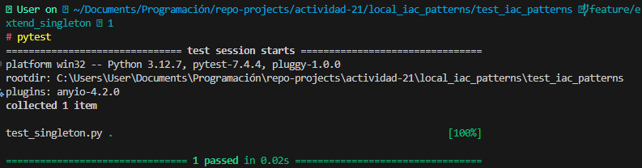
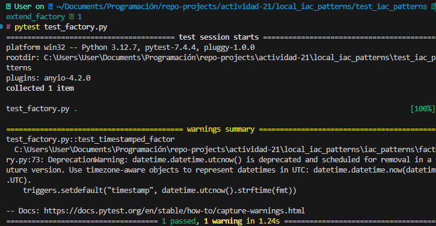

# Actividad 21

## Índice

- [Fase 1: Exploración y análisis](#fase-1-exploración-y-análisis)
  - [1. Singleton](#1-singleton)
  - [2. Factory](#2-factory)
  - [3. Prototype](#3-prototype)
  - [4. Composite](#4-composite)
  - [5. Builder](#5-builder)
- [Fase 2: Ejercicios prácticos](#fase-2-ejercicios-prácticos)
  - [Ejercicio 2.1: Extensión del Singleton](#ejercicio-21-extensión-del-singleton)
  - [Ejercicio 2.2: Variación de la Factory](#ejercicio-22-variación-de-la-factory)
  - [Ejercicio 2.3: Mutaciones avanzadas con Prototype](#ejercicio-23-mutaciones-avanzadas-con-prototype)
  - [Ejercicio 2.4: Submódulos con Composite](#ejercicio-24-submódulos-con-composite)
  - [Ejercicio 2.5: Builder personalizado](#ejercicio-25-builder-personalizado)
- [Fase 3: Desafíos teórico-prácticos](#fase-3-desafíos-teórico-prácticos)
  - [3.1 Comparativa Factory vs Prototype](#31-comparativa-factory-vs-prototype)
  - [3.2 Patrones avanzados: Adapter](#32-patrones-avanzados-adapter)
  - [3.3 Tests automatizados con pytest](#33-tests-automatizados-con-pytest)
  - [3.4 Escalabilidad de JSON](#34-escalabilidad-de-json)

## Fase 1: Exploración y análisis

### 1. Singleton

Explica cómo `SingletonMeta` garantiza una sola instancia y el rol del `lock`.

```python
class SingletonMeta(type):
    _instances: Dict[type, "ConfigSingleton"] = {}
    _lock: threading.Lock = threading.Lock()  # Controla el acceso concurrente

    def __call__(cls, *args, **kwargs):
        with cls._lock:
            if cls not in cls._instances:
                cls._instances[cls] = super().__call__(*args, **kwargs)
        return cls._instances[cls]
```

La clase `SingletonMeta` garantiza que solo exista una instancia de la clase usando un diccionario interno `_instances: Dict[type, "ConfigSingleton"] = {}` (inicialmente vacio) donde guarda la instancia única.

*metodo `__call__`*

Cuando se intenta crear una nueva instancia, el método `__call__` revisa si ya existe una instancia ya creada; si no existe, la crea y la guarda.

*atributo `_lock`*

Controla la creación de varias instancias concurrentes de nuestra clase `SingletonMeta`, solo un hilo pueda crear la instancia a la vez.

### 2. Factory

Detalla cómo `Factory` encapsula la creación de `null_resource` y el propósito de sus `triggers`.

```python
from typing import Dict, Any
import uuid
from datetime import datetime

class NullResourceFactory:
    #deco
    @staticmethod
    def create(name: str, triggers: Dict[str, Any] | None = None) -> Dict[str, Any]:
        triggers = triggers or {}

        # Agrega un trigger por defecto: UUID aleatorio para asegurar unicidad
        triggers.setdefault("factory_uuid", str(uuid.uuid4()))

        # Agrega un trigger con timestamp actual en UTC
        triggers.setdefault("timestamp", datetime.utcnow().isoformat())

        # Retorna el recurso estructurado como se espera en archivos .tf.json
        return {
            "resource": [{
                "null_resource": [{
                    name: [{
                        "triggers": triggers
                    }]
                }]
            }]
        }

```

La clase `NullResourceFactury` encapsula la creación de recursos `null_resource` al usar un método estático `@staticmethod`. Esto permite poder llamar directamente desde la `Factory` sin crear una instancia.

útil porque la creación del recurso ya no dependerá de ningún estado interno del objeto, sino de los argumentos que recibe.

- *triggers*

Los triggers crean una uuid y un timestap para el recurso `null_resource` para que no puedan ser modificado erroneamente asegurando inmutabilidad.

### 3. Prototype

```python
import copy
from typing import Dict, Any

class ResourcePrototype:
    # constructor
    def __init__(self, resource_dict: Dict[str, Any]) -> None:
        self._resource_dict = resource_dict

    def clone(self, mutator=lambda d: d) -> "ResourcePrototype":
        new_dict = copy.deepcopy(self._resource_dict)
        mutator(new_dict)
        return ResourcePrototype(new_dict)

    @property
    def data(self) -> Dict[str, Any]:
        return self._resource_dict
```

```txt
+---------------------+
|  ResourcePrototype  |
+---------------------+
| - _resource_dict    |
+---------------------+
| + __init__()        |
| + clone(mutator)    |
| + data              |
+---------------------+
         |
         | clone(mutator)
         v
+---------------------+
|  copy.deepcopy()    |
+---------------------+
         |
         v
+---------------------+
|   mutator(new_dict) |
+---------------------+
         |
         v
+---------------------+
|  ResourcePrototype  |
|   (nuevo objeto)    |
+---------------------+
```

`Mutator` es una función que recibe el diccionario clonado, hace una copia profunda para que los cambios en los clones no afecten el objeto original. Así permite hacer personalizaciones de manera directa y que no repercutan en la forma que se instancia el diccionario original

### 4. Composite

**Tarea:** Describe cómo CompositeModule agrupa múltiples bloques en un solo JSON válido para Terraform.

Analizando la clase ``CompositeModule``, tenemos dos observaciones preliminares:

1. No trabaja directamente con cadenas JSON, sino con diccionarios de Python que las representan, lo cuál hace que la lógica del negocio esté bien encapsulada.
2. El patrón Composite se respeta, ya que las funciones que expone son compatibles: ``add`` toma como argumento un diccionario, mientras que ``export`` retorna un diccionario de las mismas características.

La clase ``CompositeModule`` define un objeto de composición que agrupa diccionarios que representan bloques de creación de recursos de Terraform. Esta agrupación es almacenada en el atributo de clase ``_children`` en forma de lista.

El método ``add`` modifica esta lista para añadir nuevos bloques en forma de diccionarios, mientras que el método ``export`` convierte esta lista en un diccionario que represente un bloque mayor unificado y lo retorna, o bien a un objeto de la misma clase ``CompositeModule`` en una jerarquía superior del árbol de composición, o bien como producto final de la composición de bloques de Terraform.

Resaltamos entonces la naturaleza recursiva del patrón, donde solo definimos lo que tiene que hacer cada nodo con los nodos inferiores para formar todo el árbol.

### 5. Builder

## Fase 2: Ejercicios prácticos

Extiende el código base en una rama nueva por ejercicio:

### Ejecución

Para probar cada uno de los patrones de diseño ejecuta los siguientes comandos para cada uno de los tests.

```bash
cd local_iac_patterns/test_iac_patterns
pytest test_<patron>.py
```

### Ejercicio 2.1: Extensión del Singleton

`Reset` permite limpiar la configuración sin perder información sobre la instancia o su creación

  ```python
    class ConfigSingleton(metaclass=SingletonMeta):
    # ...
    def reset(self) -> None:
        """
        Limpia las configuraciones guardadas en settings.
        """
        self.settings.clear()
  ```

Validación:

  ```python
    c1 = ConfigSingleton("dev")
    created = c1.created_at
    c1.settings["x"] = 1
    c1.reset()
    assert c1.settings == {}
    assert c1.created_at == created
  ```



### Ejercicio 2.2: Variación de la Factory

La clase `TimestampedNullResourceFactory` hereda de `NullResourceFactory` y extiende su funcionalidad para permitir que el recurso generado incluya un **timestamp**  con un formato personalizado.

```python
class TimestampedNullResourceFactory(NullResourceFactory):
    """
    Fábrica que permite especificar el formato del timestamp para el trigger.
    """

    @staticmethod
    def create(name: str, triggers: Dict[str, Any] | None = None, fmt: str = "%Y-%m-%dT%H:%M:%S") -> Dict[str, Any]:
        """
        Crea un bloque de recurso Terraform tipo `null_resource` con triggers personalizados y timestamp formateado.

        Args:
            name: Nombre del recurso dentro del bloque.
            triggers: Diccionario de valores personalizados que activan recreación del recurso.
            fmt: Formato de fecha y hora para el trigger timestamp.

        Returns:
            Diccionario compatible con la estructura JSON de Terraform para null_resource.
        """
        triggers = triggers or {}

        # Agrega un trigger por defecto: UUID aleatorio para asegurar unicidad
        triggers.setdefault("factory_uuid", str(uuid.uuid4()))

        # Agrega un trigger con timestamp actual en el formato especificado
        triggers.setdefault("timestamp", datetime.utcnow().strftime(fmt))

        # Retorna el recurso estructurado como se espera en archivos .tf.json
        return {
            "resource": [{
                "null_resource": [{
                    name: [{
                        "triggers": triggers
                    }]
                }]
            }]
        }
```

Validación:

```python
from local_iac_patterns.iac_patterns.factory import TimestampedNullResourceFactory

def test_timestamped_factor_simple():
    resource = TimestampedNullResourceFactory.create("test", fmt="%Y%m%d")
    assert "resource" in resource
    triggers = resource["resource"][0]["null_resource"][0]["test"][0]["triggers"]
    assert "timestamp" in triggers
    assert len(triggers["timestamp"]) == 8  # 'YYYYMMDD' tiene 8 caracteres
```



### Ejercicio 2.3: Mutaciones avanzadas con Prototype

Valida el uso del patrón Prototype para clonar y mutar recursos de Terraform representados como diccionarios.

```python
from local_iac_patterns.iac_patterns.prototype import ResourcePrototype

#mutator
def add_welcome_file(block: dict):
    block["resource"]["null_resource"]["app_0"]["triggers"]["welcome"] = "¡Hola!"
    block["resource"]["local_file"] = {
        "welcome_txt": {
            "content": "Bienvenido",
            "filename": "${path.module}/bienvenida.txt"
        }
    }

def test_clone_with_local_file():
    prototipo_base = {
        "resource": {
            "null_resource": {
                "app_0": {
                    "triggers": {}
                }
            }
        }
    }
    proto = ResourcePrototype(prototipo_base)
    clon = proto.clone(mutator=add_welcome_file)
    assert "local_file" in clon.data["resource"]
    assert clon.data["resource"]["null_resource"]["app_0"]["triggers"]["welcome"] == "¡Hola!"
```

### Ejercicio 2.4: Submódulos con Composite

El método **export** combina todos los recursos y submódulos agregados al objeto CompositeModule en un solo diccionario, que luego puede ser convertido directamente a un archivo JSON válido para Terraform.

```python
    def export(self) -> Dict[str, Any]:
        """
        Exporta todos los recursos y submódulos agregados en un único diccionario.
        Esta estructura se puede serializar directamente a un archivo Terraform JSON válido.

        Returns:
            Un diccionario con todos los recursos y módulos combinados.
        """
        merged: Dict[str, Any] = {"resource": [], "module": {}}
        for child in self._children:
            if "resource" in child:
                merged["resource"].extend(child.get("resource", []))
            if "module" in child:
                merged["module"].update(child.get("module", {}))
        # Elimina claves vacías para compatibilidad con Terraform
        if not merged["resource"]:
            del merged["resource"]
        if not merged["module"]:
            del merged["module"]
        return merged
```

### Ejercicio 2.5: Builder personalizado

```python
def build_group(self, name: str, size: int):
    base = NullResourceFactory.create(name)
    proto = ResourcePrototype(base)
    group = CompositeModule()
    for i in range(size):
        def make_mut(idx):
            def mut(block):
                res = block["resource"]["null_resource"].pop(name)
                block["resource"]["null_resource"[f"{name}_{idx}"] = res
            return mut
        group.add(proto.clone(make_mut(i)))
    self.module.add({"module": {name: group.expor()}})
    return self
```

Validación:

El test comprueba que el método `build_group` de `InfrastructureBuilder` genera correctamente la estructura anidada esperada en el archivo JSON exportado.

```python
# ...
def test_build_group_export_structure():
    builder = InfrastructureBuilder("dev")
    builder.build_group("mygroup", 2)
    with tempfile.TemporaryDirectory() as tmpdir:
        path = os.path.join(tmpdir, "main.tf.json")
        builder.export(path)
        with open(path, "r") as f:
            data = json.load(f)
        # Validar estructura anidada
        assert "module" in data
        assert "mygroup" in data["module"]
        assert "resource" in data["module"]["mygroup"]
        # Debe haber dos recursos null_resource
        resources = data["module"]["mygroup"]["resource"]
        assert any("null_resource" in r for r in resources)
```

- Se crea un **builder** y se le pide que construya un grupo llamado "mygroup" con 2 recursos. Luego,se exporta el resultado a un archivo JSON temporal.
- Se lee el archivo generado y se carga como diccionario, y se valida la estructura anidada.

## Fase 3: Desafíos teórico-prácticos

### 3.1 Comparativa Factory vs Prototype

Se usa **Factory** cuando los recursos son homogéneos, la lógica de creación es simple y centralizada, en este patrón no necesitas tener una personalización tan profunda, solo elementos básicos.
En el caso de **Prototype** se usa si se necesita clonar recursos base que vayas a personalizar uno por uno (independiente uno del otro), especialmente si las mutaciones son profundas ovariadas.

- Coste de serialización profunda (Prototype):

Prototype usa copias profundas, lo que implica mayor consumo de memoria y CPU, especialmente con estructuras grandes.

- Coste de creación directa (Factory):

Factory crea objetos directamente, sin copias profundas, por lo que es más eficiente en recursos, al buscar una personalización más simple, no consume tantos recursos.

- Mantenimiento:

Como se dijo anteriormente, factory sería más fácil de mantener debido a la creación de recursos simples, Prototype puede complicar el mantenimiento si las mutaciones son muchas o muy variadas.

## 3.2 Patrones avanzados: Adapter

Patrón adapter que transforma un bloque null_resource en un recurso simulado mock_cloud_bucket. Esto permite reutilizar la estructura de null_resource para otros propósitos en pruebas.

```python
# adapter.py
class MockBucketAdapter:
    def __init__(self, null_block: dict):
        self.null = null_block

    def to_bucket(self) -> dict:
        # Mapear triggers a parámetros de bucket simulado
        name = list(self.null["resource"]["null_resource"].keys())[0]
        return {
            "resource": {
                "mock_cloud_bucket": {
                    name: {"name": name, **self.null["resource"]["null_resource"][name]["triggers"]}
                }
            }
        }
```

- Pruebas de integración:

valida que el recurso adaptado se exporta correctamente como mock_cloud_bucket usando el builder.

```python
# ...
def test_adapter_in_builder_export():
    # Crea un null_resource usando la factory
    null_block = NullResourceFactory.create("mybucket")
    # Usa el adapter para convertirlo en un mock_cloud_bucket
    bucket_block = MockBucketAdapter(null_block).to_bucket()
    # Usa el builder para agregar el recurso adaptado
    builder = InfrastructureBuilder("dev")
    builder.module.add(bucket_block)
    # Exporta a un archivo temporal
    with tempfile.TemporaryDirectory() as tmpdir:
        path = os.path.join(tmpdir, "main.tf.json")
        builder.export(path)
        with open(path) as f:
            data = json.load(f)
        # Validación: debe existir el recurso mock_cloud_bucket
        assert "resource" in data
        assert "mock_cloud_bucket" in data["resource"]
        assert "mybucket" in data["resource"]["mock_cloud_bucket"]
```

## 3.3 Tests automatizados con pytest

```python
def test_singleton_meta():
    a = ConfigSingleton("X"); b = ConfigSingleton("Y")
    assert a is b

def test_prototype_clone_independent():
    proto = ResourcePrototype(NullResourceFactory.create("app"))
    c1 = proto.clone(lambda b: b.__setitem__("foo", 1))
    c2 = proto.clone(lambda b: b.__setitem__("bar", 2))
    assert "foo" not in c2 and "bar" not in c1
```

## 3.4 Escalabilidad de JSON

- Ejemplo de medición

```python
import os

small_tf_file = os.path.getsize("terraform/main_short.tf.json")
large_tf_file = os.path.getsize("terraform/main_large.tf.json")
print(f"Con 15 recursos: {small_tf_file/1024:.2f} KB")
print(f"Con 150 recursos: {small_tf_file/1024:.2f} KB")
```

- Estrategias de fragmentación

**Uso de módulos**

Encapsulando grupos de recursos en módulos reutilizables, reduciendo el tamaño de cada archivo.

**Automatización de generación**

Generar archivos de terraform solo para recursos necesarios en cada entorno, evitando archivos monolíticos, creando más recursos pequeños que levanten una infraestructura entre todos, como el patrón builder.
