# Actividad: Introducción a Docker, ETL en Docker Compose

En esta actividad te adentrarás en el manejo práctico de Docker y la CLI de Airflow, trabajando directamente sobre el proyecto ETL desplegado con Docker Compose.
Aprenderás a interactuar con contenedores, gestionar imágenes y redes, y a ejecutar y depurar tus DAGs de Airflow desde la línea de comandos.

La referencia completa del proyecto está disponible en GitHub:
 [Proyecto docker y Airflow](https://github.com/kapumota/DS/tree/main/2025-1/Proyecto_etl_docker_airflow).

1. **Explora tus contenedores activos y parado**
  estos comandos son la base para cualquier **flujo de trabajo con Docker**, ya que permiten gestionar recursos, liberar espacio y solucionar posibles problemas entre contenedores.

   * Arranca el proyecto completo en segundo plano:

     ```bash
     docker-compose up -d
     ```

     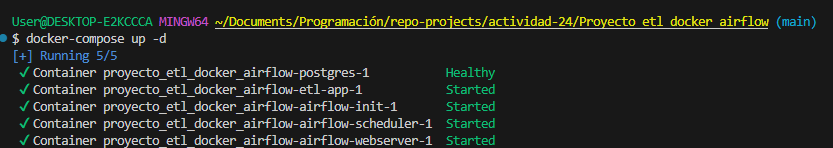

   * Lista todos los contenedores (running + stopped):

     ```bash
     docker ps -a
     ```

     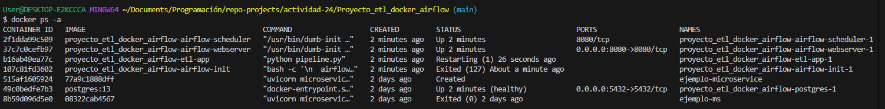

   * Frena y elimina el contenedor `etl-app` usando su CONTAINER ID:

     ```bash
     docker stop <ID>
     docker rm <ID>
     ```

     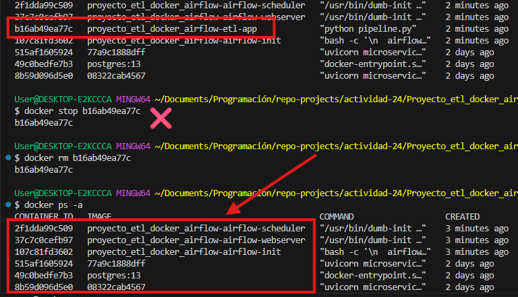

2. **Inspecciona imágenes y limpia tu sistema**
Estas operaciones son clave para mantener un entorno Docker limpio, reproducible y libre de residuos de builds anteriores.

   * Muestra todas las imágenes locales:

     ```bash
     docker images
     ```

     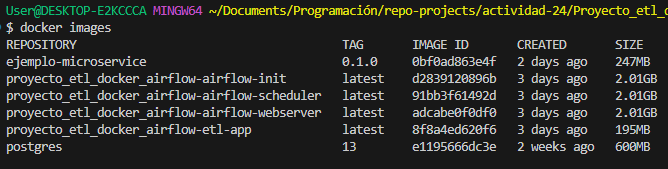

   * Elimina la imagen `etl-app` si ya no la necesitas:

     ```bash
     docker rmi <IMAGE_ID>
     ```

     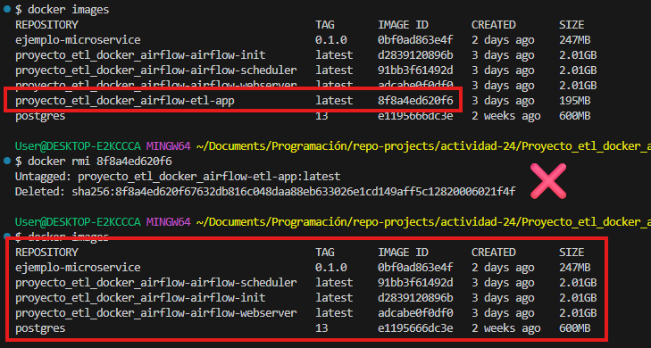

   * Forza la reconstrucción de la imagen del servicio `etl-app` con `--no-cache`:

     ```bash
     docker-compose build --no-cache etl-app
     ```

     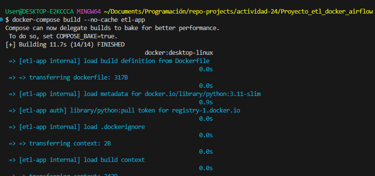

3. **Construye una imagen paso a paso**
Primero, se usa un **docker build** para crear la imagen desde el **Dockerfile**, se le asigna una etiqueta personalizada y se confirma la creación de la imagen con `docker images | grep mi_etl_app`.

   * Desde la carpeta raíz, crea manualmente la imagen de la aplicación ETL:

     ```bash
     docker build -t mi_etl_app:latest -f Dockerfile .
     ```

     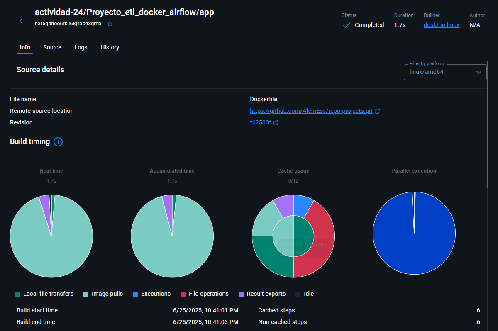

   * Verifica que la imagen exista:

     ```bash
     docker images | grep mi_etl_app
     ```

     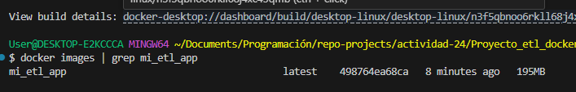

    Luego se ejecutas un contenedor basado en la imagen colocada, montando el volumen de datos local y lanzando el pipeline ETL directamente con Python

   * Lanza un contenedor de prueba ejecutando el pipeline contra tu CSV local:

     ```bash
     docker run --rm -v $(pwd)/app/data:/app/data mi_etl_app:latest python pipeline.py
     ```

4. **Tira de imágenes desde Docker Hub**

   * Descarga la imagen oficial de PostgreSQL:

     ```bash
     docker pull postgres:15
     ```

     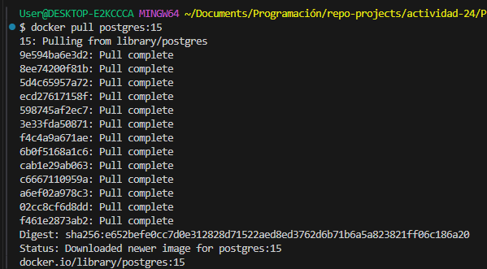

   * Lista el historial de capas de esa imagen:

     ```bash
     docker history postgres:15
     ```

    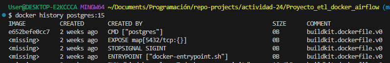

5. **Interactúa con un contenedor en ejecución**

   * Inicia un shell dentro del contenedor `etl-app`:

     ```bash
     docker exec -it <CONTAINER_ID> /bin/bash
     ```

   * Dentro del contenedor, comprueba que `input.csv` existe en `/app/data`:

     ```bash
     ls -l /app/data
     ```

   * Sal del contenedor (`exit`) y comprueba sus logs:

     ```bash
     docker logs <CONTAINER_ID> --tail 20
     ```

6. **Gestiona redes Docker**

   * Lista las redes creadas por `docker-compose`:

     ```bash
     docker network ls
     ```

     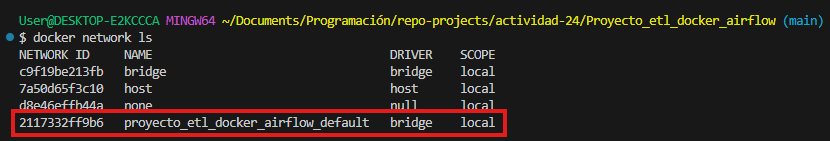

   * Inspecciona la red que usan los servicios (`proyecto_default`):

     ```bash
     docker network inspect proyecto_default
     ```

     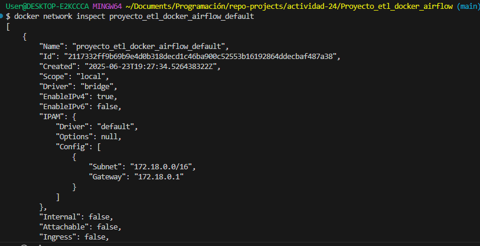

     mostrando la configuración y el estado de la red bridge creada automáticamente por Docker Compose para tu proyecto.

     * Tipo de red
     * Rango IP
     * Contenedores conectados (airflow-scheduler, airflow-webserver, postgres)

   * Conecta manualmente un contenedor extra (por ejemplo, un Alpine) a esa red y verifica la conectividad con PostgreSQL:

     ```bash
     docker run --rm -it --network proyecto_default alpine sh
     apk add --no-cache postgresql-client
     psql -h postgres -U user -d etl_db -c '\l'
     ```

     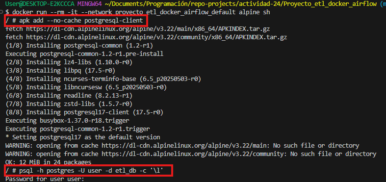

     Por lo que habrá una conexión exitosa.

7. **Airflow básico desde CLI**

   * Lista tus DAGs disponibles:

     ```bash
     docker-compose exec airflow-webserver airflow dags list
     ```

   * Triggea manualmente `etl_pipeline` para hoy:

     ```bash
     docker-compose exec airflow-webserver airflow dags trigger etl_pipeline
     ```

   * Observa el estado de las tareas:

     ```bash
     docker-compose exec airflow-webserver airflow tasks list etl_pipeline --tree
     ```

     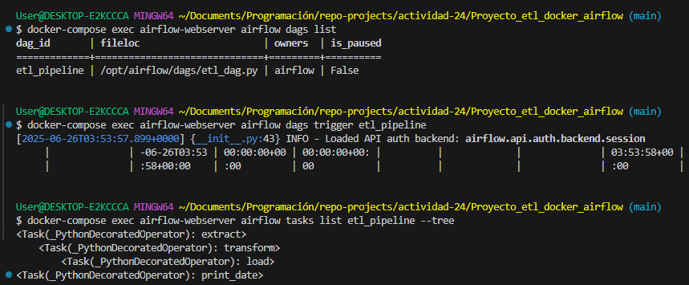

8. **Sigue logs y diagnostica errores en Airflow**

   * En Terminal B, sigue los logs del webserver:

     ```bash
     docker-compose logs -f airflow-webserver
     ```

     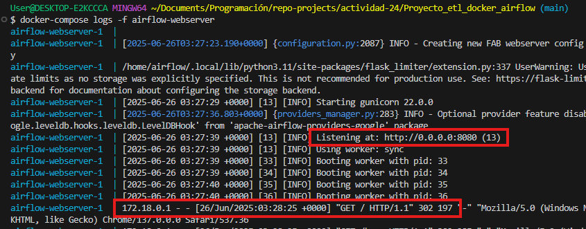

   * En Terminal C, sigue los logs del scheduler:

     ```bash
     docker-compose logs -f airflow-scheduler
     ```

     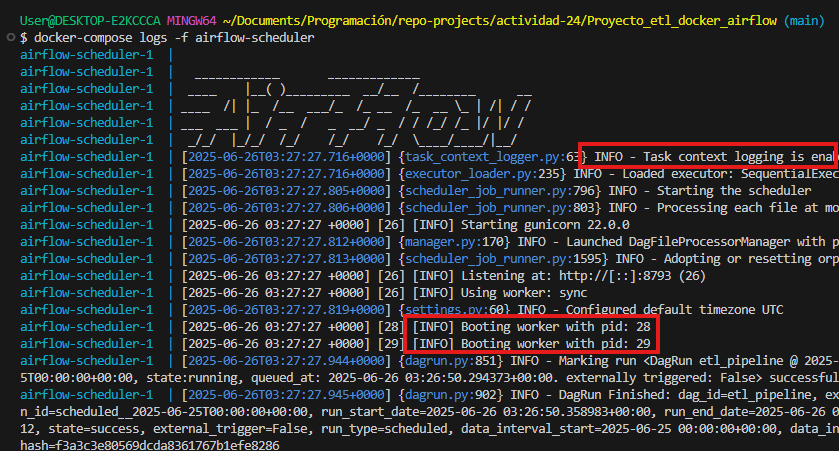

9. **Integración docker-compose vs CLI**

   * Detén y elimina todo con `docker-compose down -v`.
   * Reconstruye y arranca solo con comandos Docker puros:

     1. Construye red y red interna:

        ```bash
        docker network create proyecto_default
        ```

     2. Arranca PostgreSQL:

        ```bash
        docker run -d --name postgres --network proyecto_default \
          -e POSTGRES_DB=etl_db -e POSTGRES_USER=user -e POSTGRES_PASSWORD=pass \
          postgres:15
        ```

     3. Arranca etl-app vinculando volumen y red:

        ```bash
        docker run -d --name etl-app --network proyecto_default \
          -v $(pwd)/app/data:/app/data mi_etl_app:latest
        ```

     4. Muestra logs y comprueba la carga de datos.

10. **Retos adicionales "manos a la obra"**

    * Modifica el `Dockerfile` para usar un *multi-stage build* que pipistrelee solo las dependencias necesarias en el contenedor final.

    **Resolución:**

    El uso de multistage build en este Dockerfile permite crear imágenes más pequeñas y seguras, separando el proceso de instalación de dependencias del entorno de ejecución final.

      * **Primera etapa**: establece el directorio e instala las dependencias.

      * **Etapa final**: Usa una imagen limpia y copia la etapa anterior(builder), reduciendo el tamaño de la imagen final

    ```dockerfile
    # Primera etapa
    FROM python:3.11-slim AS builder
    WORKDIR /install
    COPY requirements.txt .
    RUN pip install --no-cache-dir -r requirements.txt

    # Etapa final
    FROM python:3.11-slim
    WORKDIR /app
    COPY --from=builder /install /usr/local
    COPY . .
    CMD ["python", "pipeline.py"]
    ```

    * Añade un volumen nombrado para persistir los datos de PostgreSQL y haz que tu `docker-compose.yml` lo use.

     *aunque el contenedor de PostgreSQL se elimine o reinicie, la base de datos y su información no se pierden*

    ```yml
    postgres:
      image: postgres:13
      restart: unless-stopped
      environment:
        POSTGRES_USER: user
        POSTGRES_PASSWORD: pass
        POSTGRES_DB: etl_db
      ports:
        - "5432:5432"
      volumes:
        - postgres_data:/var/lib/postgresql/data
      healthcheck:
        test: ["CMD-SHELL", "pg_isready -U user"]
        interval: 10s
        timeout: 5s
        retries: 5
    ```

    * Crea un pequeño DAG nuevo en `airflow/dags/` que imprima la fecha actual en consola y pruébalo con `docker-compose exec`.

    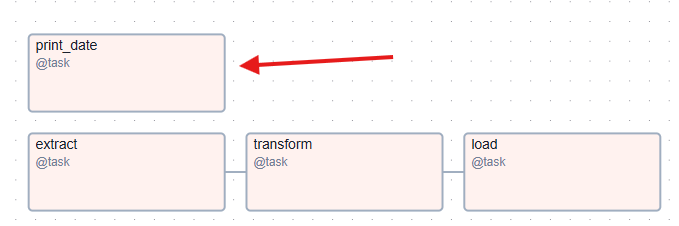

    ```python
        @task()
        def print_date():
            print(f"Fecha actual: {datetime.now()}")
        print_date()
    ```

    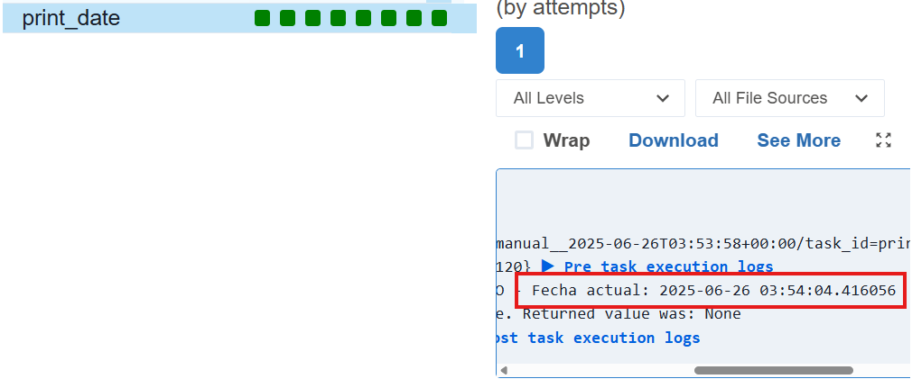
